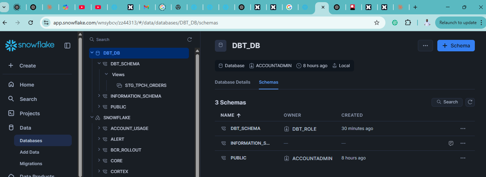

# DBT Project: Source and Staging Tables

## Project Progress
- ✅ Setup dbt + Snowflake
- ✅ Configure dbt_project.yml and packages
- ✅ Create source and staging tables
- ⬜ Transformed models (fact tables, data marts)
- ⬜ Macro functions
- ⬜ Generic and singular tests
- ⬜ Deploy models using Airflow

## Source and Staging Tables Setup

### 1. Create Source Configuration

Created `tcp_sources.yaml` in the staging folder with the following configuration:

```yaml
version: 2

sources:
  - name: tpch
    database: snowflake_sample_data
    schema: tpch_sf1
    tables:
      - name: orders
        columns:
          - name: o_orderkey
            tests:
              - unique
              - not_null
      - name: lineitem
        columns:
          - name: l_orderkey
            tests:
              - relationships:  # This is a relationship test that checks if the l_orderkey in lineitem exists in the o_orderkey in orders
                  to: source('tpch', 'orders')
                  field: o_orderkey
```

This configuration:
- Defines a source called 'tpch' that points to Snowflake's sample data
- Identifies two tables: 'orders' and 'lineitem'
- Sets up tests for data integrity:
  - Ensures o_orderkey is unique and not null
  - Verifies referential integrity between lineitem and orders tables

### 2. Create Staging Model

Created `stg_tpch_orders.sql` with the following SQL:

```sql
select * 
from {{ source('tpch', 'orders') }} 
where o_orderkey < 1000
```

This staging model:
- References the 'orders' table from the 'tpch' source
- Filters for orders with o_orderkey less than 1000
- Provides a clean, transformed view of the source data for downstream models

### 3. Run the Model

Successfully executed the model with:

```bash
dbt run
```

The model ran successfully with no errors.

### 4. Verification inside the snowflake 



add `stg_tpch_line_itmes.sql ` to the taging 

```sql
select
    {{
        -- Generate a surrogate key for the line item using the order key and line number
        -- This is a composite key that uniquely identifies each line item in an order
        -- Used when you have multiple tables you want to join on the same key
        dbt_utils.generate_surrogate_key([
            'l_orderkey',
            'l_linenumber'
        ])
    }} as order_item_key,
	l_orderkey as order_key,
	l_partkey as part_key,
	l_linenumber as line_number,
	l_quantity as quantity,
	l_extendedprice as extended_price,
	l_discount as discount_percentage,
	l_tax as tax_rate
from
    {{ source('tpch', 'lineitem') }}

    ```

## Next Steps
- Create additional staging models for remaining source tables
- Build dimension and fact tables based on the staging models
- Implement tests and documentation
- Create macros for reusable SQL logic
- Set up Airflow DAGs for orchestration