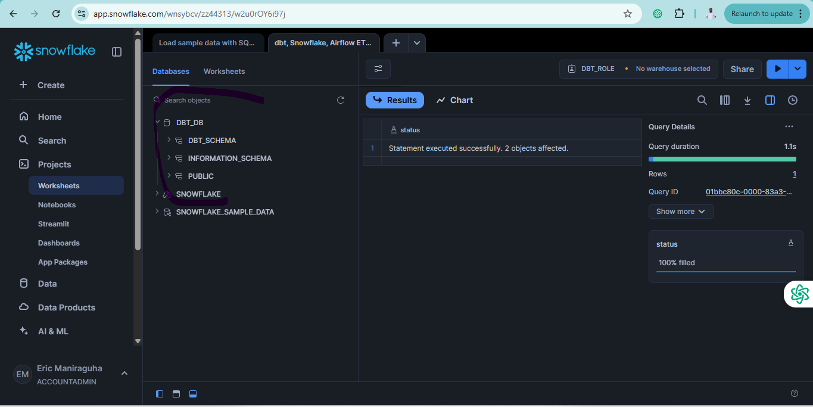

# DBT Project: Transformed Models - Fact Tables and Data Marts

## Project Progress
- ✅ Setup dbt + Snowflake
- ✅ Configure dbt_project.yml and packages  
- ✅ Create source and staging tables
- ✅ Transformed models (fact tables, data marts)
- ⬜ Macro functions
- ⬜ Generic and singular tests
- ⬜ Deploy models using Airflow

## Creating Fact Tables

Fact tables represent numeric events or measurements that are connected to various dimension tables. They are central to dimensional modeling in a data warehouse.

### Creating an Intermediate Order Items Model

In the `models/marts/` directory, create `int_order_items.sql`:

```sql
-- Transform models (fact tables, data marts)
select
    line_item.order_item_key,
    line_item.part_key,
    line_item.line_number,
    line_item.extended_price,
    orders.order_key,
    orders.customer_key,
    orders.order_date,
    {{ discounted_amount('line_item.extended_price', 'line_item.discount_percentage') }} as item_discount_amount
from
    {{ ref('stg_tpch_orders') }} as orders
join
    {{ ref('stg_tpch_line_items') }} as line_item
        on orders.order_key = line_item.order_key
order by
    orders.order_date
```

### Running the Model

To run this specific model and its dependencies:
```bash
dbt run -s +int_order_items+
```

Alternatively, run all models with:
```bash
dbt run
```

> **Note:** When using the selector syntax (`-s +int_order_items+`), the plus signs are required to include dependencies. Without them, you might encounter errors.