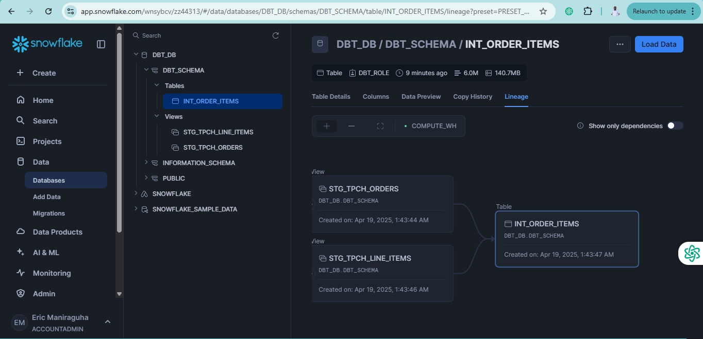

# DBT Project: Macro Functions

Macros are reusable pieces of code that implement business logic across multiple models. They function like methods or functions in programming languages and help maintain consistent logic throughout your dbt project.

[Learn more about macros in the dbt documentation](https://docs.getdbt.com/docs/build/jinja-macros)

## Project Progress
- ✅ Setup dbt + Snowflake
- ✅ Configure dbt_project.yml and packages
- ✅ Create source and staging tables
- ✅ Transformed models (fact tables, data marts)
- ✅ Macro functions
- ⬜ Generic and singular tests
- ⬜ Deploy models using Airflow

## Creating a Pricing Macro

Create a macro function in the `macros/pricing.sql` file:

```sql

    (-1 * {{extended_price}} * {{discount_percentage}})::decimal(16, {{ scale }})

```

This macro calculates the discount amount by multiplying the extended price by the discount percentage, then formatting it as a decimal with the specified scale (defaulting to 2 decimal places).

## Using the Macro in Models

### Update `int_order_items.sql`

```sql
select
    line_item.order_item_key,
    line_item.part_key,
    line_item.line_number,
    line_item.extended_price,
    orders.order_key,
    orders.customer_key,
    orders.order_date,
    {{ discounted_amount('line_item.extended_price', 'line_item.discount_percentage') }} as item_discount_amount
from
    {{ ref('stg_tpch_orders') }} as orders
join
    {{ ref('stg_tpch_line_items') }} as line_item
        on orders.order_key = line_item.order_key
order by
    orders.order_date
```

Test your changes by running:
```bash
dbt run -s +int_order_items+
```

## Creating Aggregation Models

### Create `marts/int_order_items_summary.sql`

This intermediate model aggregates order item data:

```sql
select 
    order_key,
    sum(extended_price) as gross_item_sales_amount,
    sum(item_discount_amount) as item_discount_amount
from
    {{ ref('int_order_items') }}
group by
    order_key
```

### Create the Final Fact Model `models/marts/fct_orders.sql`

This fact table combines order information with summarized order item data:

```sql
select
    orders.*,
    order_item_summary.gross_item_sales_amount,
    order_item_summary.item_discount_amount
from
    {{ref('stg_tpch_orders')}} as orders
join
    {{ref('int_order_items_summary')}} as order_item_summary
        on orders.order_key = order_item_summary.order_key
order by order_date
```

Run all models to verify everything works properly:
```bash
dbt run
```
