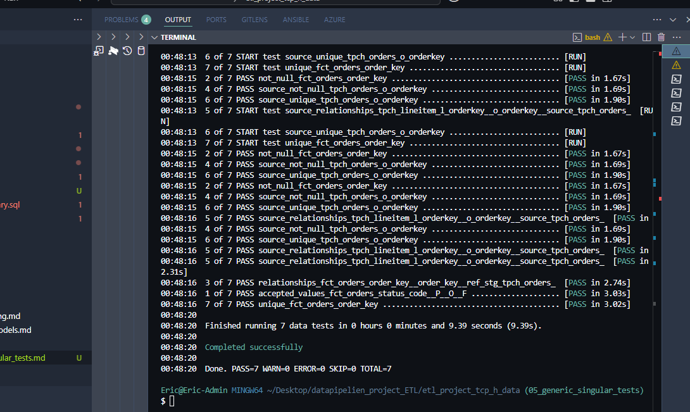
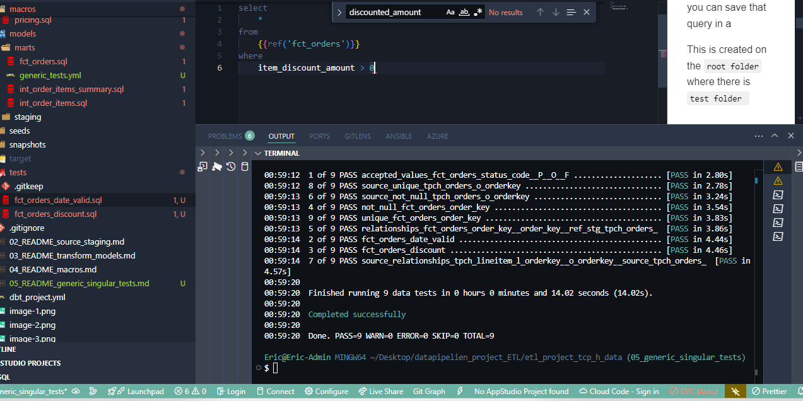

# DBT Project: Generic and Singular Tests

Data tests in dbt help ensure the integrity, quality, and correctness of your transformed data. There are two main types of tests:

## Singular Tests

Singular tests are custom SQL queries that return failing rows. Any rows returned represent test failures.

- Created in the `tests/` folder at the project root level
- Each test is a standalone SQL file
- Complete control over test logic
- Perfect for complex business logic validations

## Generic Tests

Generic tests are reusable, parameterized tests defined in YAML files.

- Created in model schema files (typically `*.yml` files)
- No SQL writing required - just configuration
- Easy to apply the same test to multiple columns or models

### Built-in Generic Tests

dbt provides several built-in generic tests:

- `unique`: Ensures values in a column are unique
- `not_null`: Ensures no null values exist in a column
- `accepted_values`: Ensures values in a column belong to a defined set
- `relationships`: Ensures referential integrity between tables (foreign key validation)

[Learn more about dbt data tests](https://docs.getdbt.com/docs/build/data-tests)

## Project Progress
- ✅ Setup dbt + Snowflake
- ✅ Configure dbt_project.yml and packages
- ✅ Create source and staging tables
- ✅ Transformed models (fact tables, data marts)
- ✅ Macro functions
- ✅ Generic and singular tests
- ⬜ Deploy models using Airflow

## Creating Generic Tests

Create a file named `generic_tests.yml` inside the `models/marts/` directory:

```yaml
models:
  - name: fct_orders
    columns:
      - name: order_key
        tests:
          - unique                      # ✅ Checks that order_key is unique
          - not_null                    # ✅ Checks that order_key has no nulls
          - relationships:              # ✅ Checks that order_key matches a key in another model
              to: ref('stg_tpch_orders')
              field: order_key
              severity: warn            # ⚠️ This failure will generate a warning instead of error

      - name: status_code
        tests:
          - accepted_values:            # ✅ Checks that status_code is one of P, O, or F
              values: ['P', 'O', 'F']
```

Run the tests with:
```bash
dbt test
```



## Creating Singular Tests

### Test for Negative Discounts

Create `tests/fct_orders_discount.sql`:

```sql
-- This test finds orders with negative discount amounts (which should not exist)
select
    *
from
    {{ref('fct_orders')}}
where
    item_discount_amount > 0
```

### Test for Valid Order Dates

Create `tests/fct_orders_date_valid.sql`:

```sql
-- This test finds orders with dates that are either in the future or before 1990
select
    *
from
    {{ref('fct_orders')}}
where
    date(order_date) > CURRENT_DATE()
    or date(order_date) < date('1990-01-01')
```



Run singular tests with:
```bash
dbt test
```

Or run specific tests with:
```bash
dbt test --select tests/fct_orders_discount.sql
```