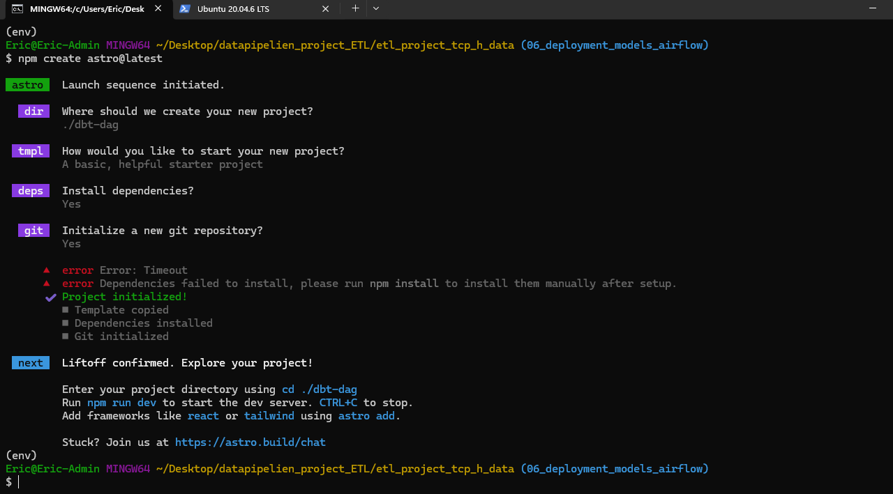
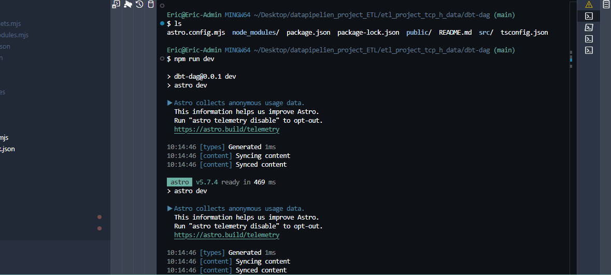
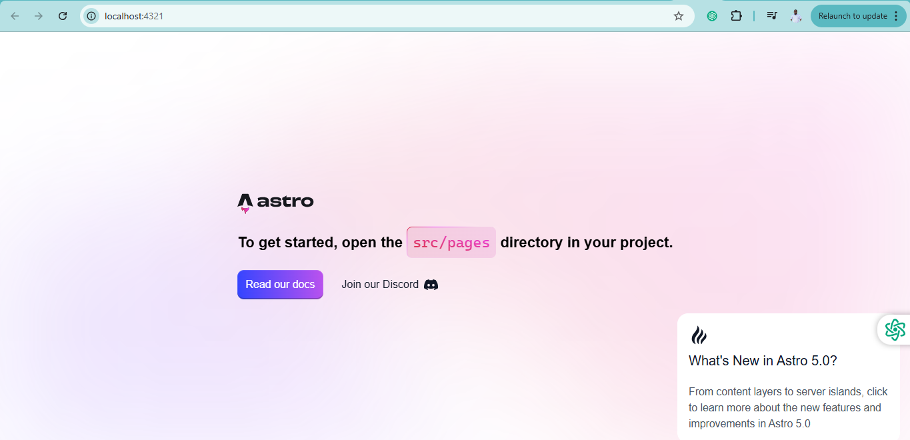

# DBT Project: Deploy Models Using Airflow

This section covers how to automate your dbt workflow using Apache Airflow for orchestration and scheduling.

## Project Progress
- ✅ Setup dbt + Snowflake
- ✅ Configure dbt_project.yml and packages
- ✅ Create source and staging tables
- ✅ Transformed models (fact tables, data marts)
- ✅ Macro functions
- ✅ Generic and singular tests
- ✅ Deploy models using Airflow

## Using Cosmos for Deployment

[Cosmos](https://www.astronomer.io/cosmos/) is an open-source framework that helps integrate dbt Core with Apache Airflow seamlessly. It generates Airflow tasks directly from your dbt project's structure.

## Required Packages

### Installing Astro CLI on Windows

### Windows Installation Options

Since the standard Astro CLI installation can be challenging on Windows, here are clear instructions for getting your environment set up using Node.js:

### Option 1: Install via Node.js (Recommended)

1. **Install Node.js**:
   - Visit [https://nodejs.org](https://nodejs.org)
   - Download and install the LTS (Long Term Support) version
   - Complete the installation wizard with default settings
   - Install Astro: https://docs.astro.build/en/install-and-setup/

2. **Verify Installation**:
   - Open PowerShell or Command Prompt
   - Run these commands to verify installation:
     ```
     node -v
     npm -v
     ```
   - You should see version numbers displayed for both

3. **Create Astro Project**:
   - Run this command:
     ```
     npm create astro@latest
     ```
   - Follow the interactive prompts:
     - Enter your project name (e.g., `dbt-dag`)
     - Select a template (use "minimal" for a basic setup)
     - Choose "Yes" when asked to install dependencies



4. **Navigate to Project and Start**:
   - Change directory to your project:
     ```
     cd dbt-dag
     npm run dev
     ```
   - Your development server will start at http://localhost:4321

   
   
### Option 2: Use Docker Directly

If you prefer to skip Astro CLI and use Docker directly:

1. **Install Docker Desktop** for Windows
2. Create a project directory and the following files:
   - `docker-compose.yml` with Airflow services
   - Basic folder structure for Airflow

3. Start your containers with:
   ```
   docker-compose up -d
   ```

### Option 3: Use WSL (Windows Subsystem for Linux)

For a more Linux-like experience:

1. **Enable WSL2**:
   - Open PowerShell as Administrator
   - Run: `wsl --install`
   - Restart your computer

2. **Install Ubuntu** from Microsoft Store

3. **Install Astro in WSL**:
   - Open Ubuntu terminal
   - Run: `curl -sSL https://install.astronomer.io | sudo bash`

4. **Use Astro CLI** as you would on Linux:
   ```
   astro dev init
   astro dev start
   ```

## Next Steps

After setting up your environment, continue with:

1. Creating your DBT DAG file
2. Configuring Snowflake connections
3. Setting up your project structure
4. Testing and running your workflow

